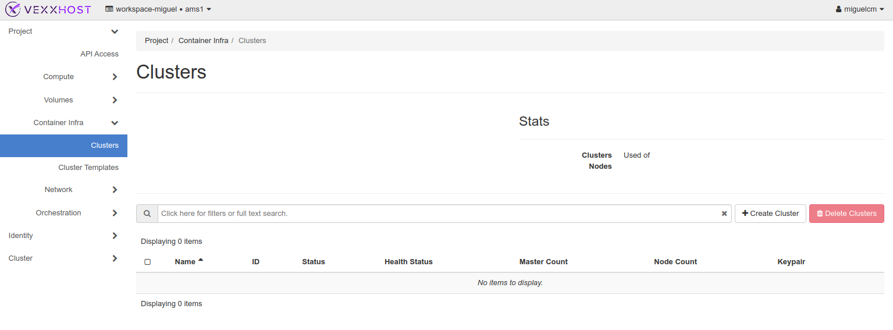
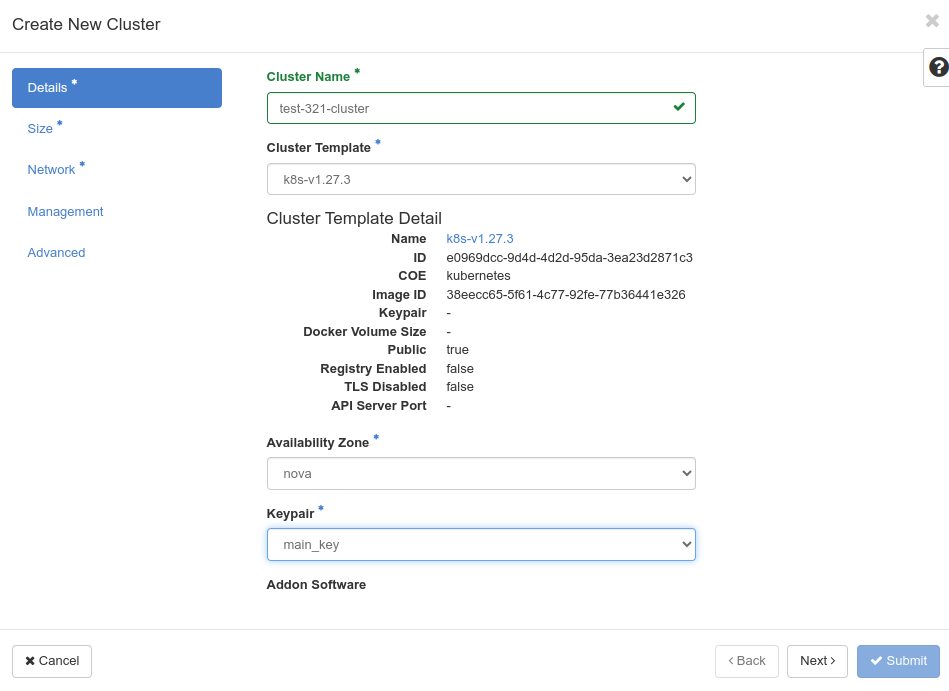
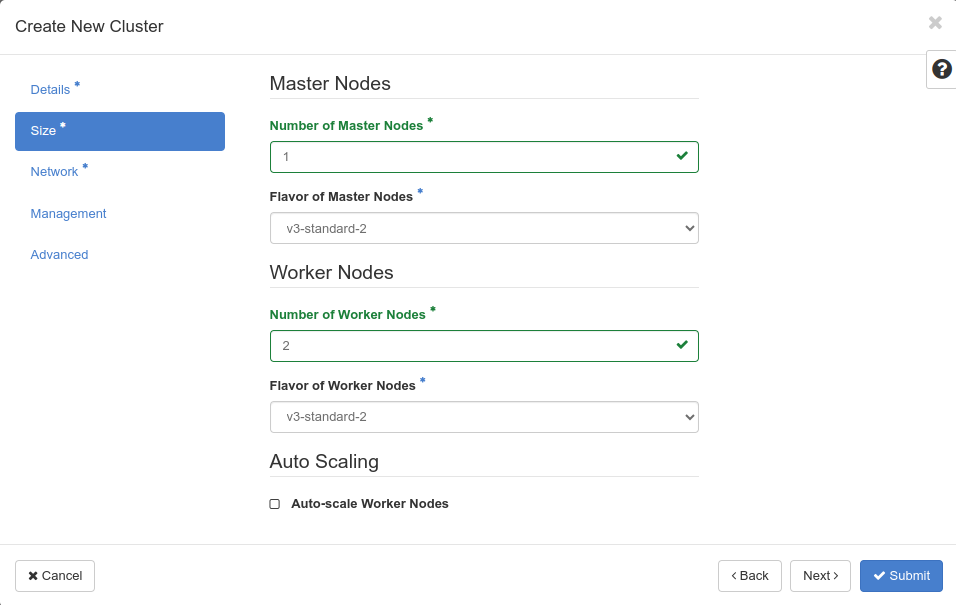
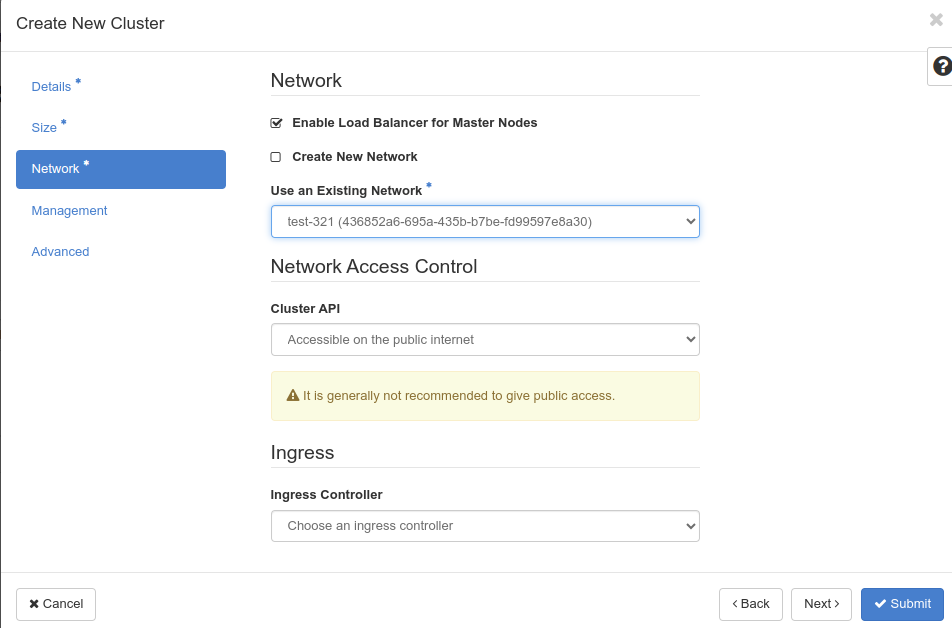

# Create a Private/Project Network 

Access your network settings or dashboard. Left side menu under “Project” -> “Network” -> “Networks” 

Click on “Create Network”, a window will pop up asking for details: 

Field “Network Name” we choose `test-321`, and in addition, a subnet associated with the network can be created in the following steps of this wizard. 

Click on “Next”: 

* **Subnet Name:** Choose a suitable name for the subnet (e.g., "test-321-subnet"). 
* **Network Address:** On this occasion we specified the CIDR as "10.0.20.0/24" to assign IP addresses in the range from 10.0.20.1 to 10.0.20.254. 

Click on “Next”: 

* **DNS Name Servers:** For our scenario we enter "1.1.1.1" as the DNS server for the subnet 

Click on “Create”

# Create a Router with External Access 

Now that we have a private/project network we have to create a router that allows access to the external world (Internet). 

Router settings are found on the dashboard. Left side menu under “Project” -> “Network” -> “Routers” 

Click on the "Create Router" 

* **Router Name:** Enter a descriptive name for your router. Choose a name that helps you easily identify its purpose and associated network. 
* **External Network:** In this step, you need to select the external network that connects your private/project network to the Internet. We choose the "public" network from the available options. 

Now, we need to attach the new router to the subnet from the private/project network `test-321` 

If we go back to the router we just created. Click on the name: `test-321-router` and some options will appear. Between them “Interfaces”, Click on the Tab and followed by “Add Interface”. 

Just on the Subnet drop menu, select `test-321-subnet` that is the one to correspond to private/project network `test=321`  

In the end, just click in the button “Submit”

# How to Create Cluster with Existing Private Network 

Sometimes, you might find yourself wanting to set up a Kubernetes cluster on a private network, allowing you to control access to your services both publicly and privately. This guide will walk you through the straightforward steps to achieve just that! 

We already have in place a private/project network, which is already configured with a subset pointing to the DNS server 1.1.1.1. Additionally, there is a router attached to the external network for public access. It is called `test-321`. 

Now, it is time to setup the k8s cluster. Go to the left menu and select “Container Infra”, followed by “Clusters”. Click in “Create Cluster”:

Once the window pops up. We have some “Details” to fill up: 

* **Cluster Name:** The name of the cluster that will be created. 
* **Cluster Template:** The cluster template that will be used to create the cluster. 
* **Keypair:** The SSH key pair that will be used to access the cluster. 

It's time to determine the ideal size of your Kubernetes cluster and decide whether you want to enable auto scaling. The required fields are: 

* **Number of Master Nodes:** Enter the desired number of master nodes you'd like to create for your cluster.
* **Flavor of Master Nodes:** Select the flavor to be used for the master nodes 
* **Number of Worker Nodes:** Specify the number of worker nodes to be created in your cluster. 
* **Flavor of Worker Nodes:** Choose the flavor for the worker nodes. 

Configuring your cluster's network settings. Here are the essential fields you need to consider: 

* **Enable Load Balancer for Master Nodes:** It's essential to enable this option for the Cluster API driver to function smoothly with Magnum. This setting ensures seamless communication and coordination among the master nodes. 
* **Existing Network:** You will be using an existing private/project network for your cluster. This allows you to connect the cluster to a network that already hosts other resources, making it easier to manage your infrastructure effectively. On this occasion `test-321` 
* **Cluster API:** Choose "Private Network" for added security or "Public Internet" for external access. We selected “Accessible on the public Internet” 

I n the end, just click in the button “Submit” 
