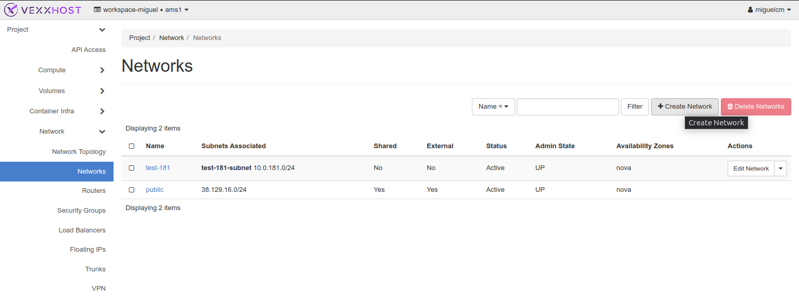
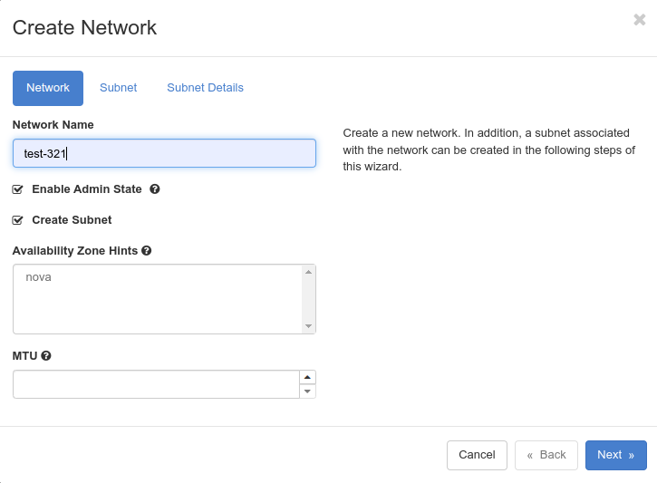
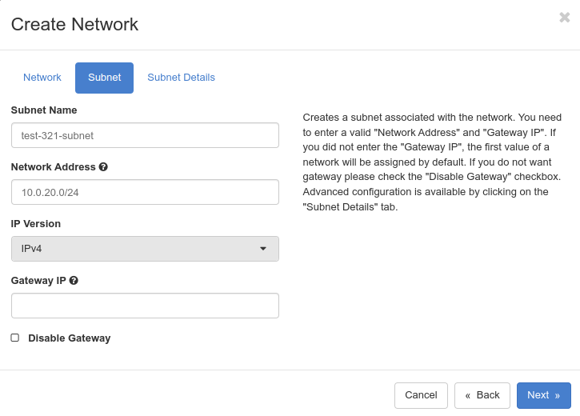
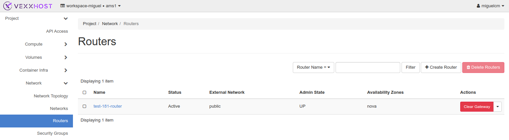
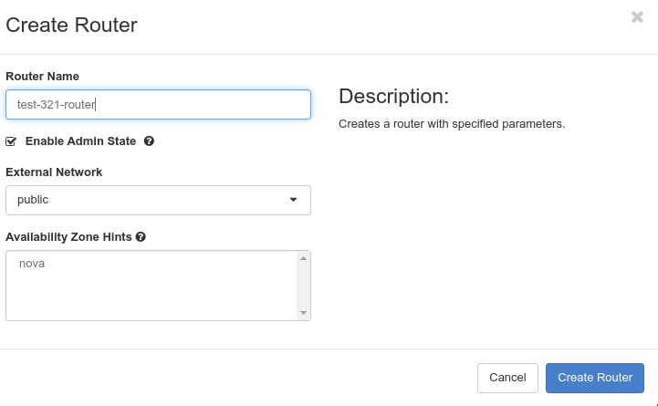
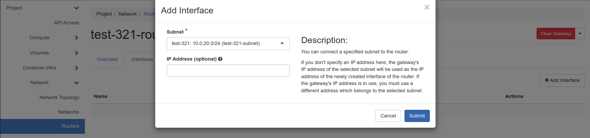

# Create a Private/Project Network 

Access your network settings or dashboard. Left side menu under “Project” -> “Network” -> “Networks” 

Click on “Create Network”, a window will pop up asking for details: 

Field “Network Name” we choose `test-321`, and in addition, a subnet associated with the network can be created in the following steps of this wizard. 

Click on “Next”: 

* **Subnet Name:** Choose a suitable name for the subnet (e.g., "test-321-subnet"). 
* **Network Address:** On this occasion we specified the CIDR as "10.0.20.0/24" to assign IP addresses in the range from 10.0.20.1 to 10.0.20.254. 

Click on “Next”: 

* **DNS Name Servers:** For our scenario we enter "1.1.1.1" as the DNS server for the subnet 

Click on “Create”

# Create a Router with External Access 

Now that we have a private/project network we have to create a router that allows access to the external world (Internet). 

Router settings are found on the dashboard. Left side menu under “Project” -> “Network” -> “Routers” 

Click on the "Create Router" 

* **Router Name:** Enter a descriptive name for your router. Choose a name that helps you easily identify its purpose and associated network. 

* **External Network:** In this step, you need to select the external network that connects your private/project network to the Internet. We choose the "public" network from the available options. 

Now, we need to attach the new router to the subnet from the private/project network `test-321` 

If we go back to the router we just created. Click on the name: `test-321-router` and some options will appear. Between them “Interfaces”, Click on the Tab and followed by “Add Interface”. 

Just on the Subnet drop menu, select `test-321-subnet` that is the one to correspond to private/project network `test=321`  

In the end, just click in the button “Submit” 
