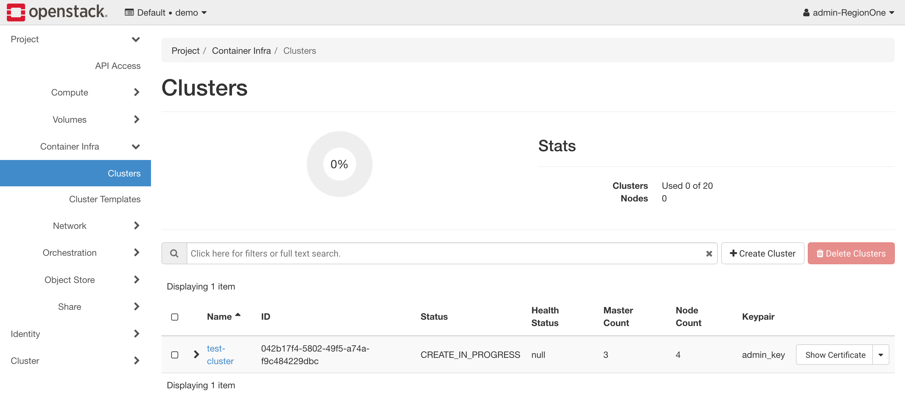
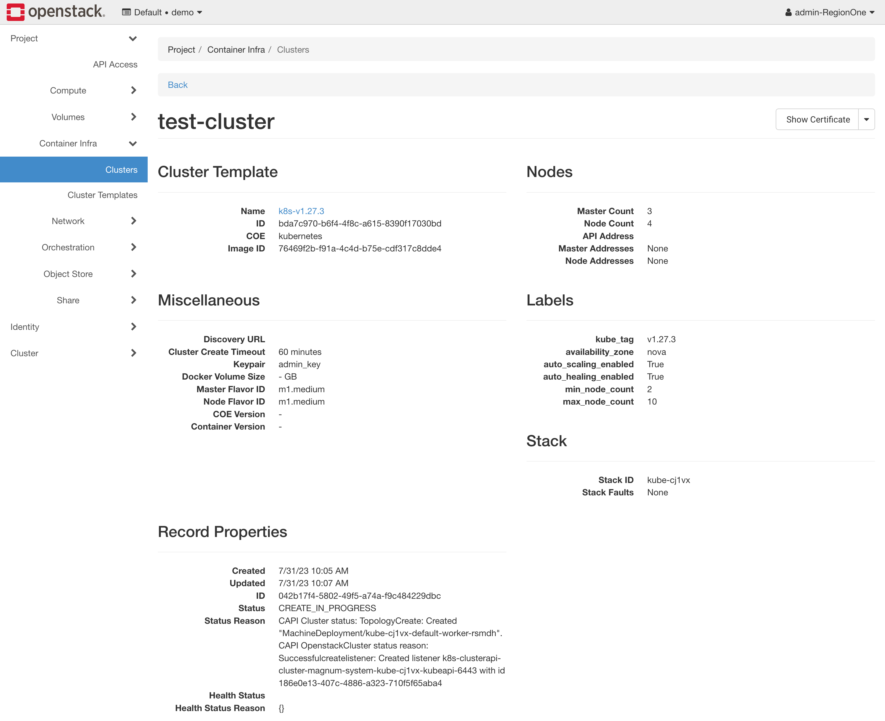
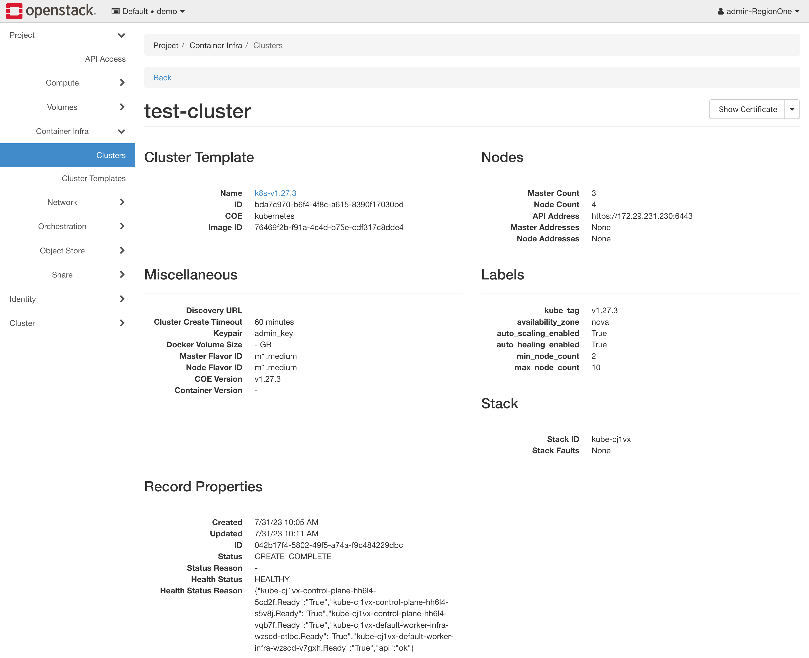

# Getting Started

## Cluster Operations

### Creating

You can use a few different methods to create a Kubernetes cluster with the
Cluster API driver for Magnum.  We cover a few different methods in this
section.

!!! note "Notes about deployment speed"

    The Cluster API driver for Magnum is designed to be fast.  It is capable of
    deploying a Kubernetes cluster in under 5 minutes.  However, there are several
    factors that can slow down the deployment process:

    * **Operating system image size**
      The average size of the operating system image is around 4 GB.  The image
      needs to be downloaded to each node before deploying the cluster, and the
      download speed depends on the network connection. The compute service caches
      images locally, so the initial cluster deployment is slower than subsequent
      deployments.

    * **Network connectivity**
      When the cluster goes up, it needs to pull all the container images from the
      container registry.  By default, it will pull all the images from the upstream
      registries.  If you have a slow network connection, you can use a local
      registry to speed up the deployment process and read more about pointing to
      it in the [Labels](labels.md#images) section.

    [Atmosphere](https://github.com/vexxhost/atmosphere) deploys a local
    registry by default as well as includes several speed optimizations to
    improve the deployment speed down to 5 minutes.

You can create clusters using several different methods which all end up using
the Magnum API.  You can either use the OpenStack CLI, OpenStack Horizon
dashboard, Terraform, Ansible or the Magnum API directly.

=== "OpenStack CLI"

    The OpenStack CLI is the easiest way to create a Kubernetes cluster from
    your terminal directly.  You can use the `openstack coe cluster create`
    command to create a Kubernetes cluster with the Cluster API driver for Magnum.

    Before you get started, you'll have to make sure that you have the cluster
    templates you want to use available in your environment.  You can create
    them using the OpenStack CLI:

    ```bash
    export OS_DISTRO=ubuntu # you can change this to "flatcar" if you want to use Flatcar
    for version in v1.24.16 v1.25.12 v1.26.7 v1.27.4; do \
      [[ "${OS_DISTRO}" == "ubuntu" ]] && IMAGE_NAME="ubuntu-2204-kube-${version}" || IMAGE_NAME="flatcar-kube-${version}"; \
      curl -LO https://object-storage.public.mtl1.vexxhost.net/swift/v1/a91f106f55e64246babde7402c21b87a/magnum-capi/${IMAGE_NAME}.qcow2; \
      openstack image create ${IMAGE_NAME} --disk-format=qcow2 --container-format=bare --property os_distro=${OS_DISTRO} --file=${IMAGE_NAME}.qcow2; \
      openstack coe cluster template create \
          --image $(openstack image show ${IMAGE_NAME} -c id -f value) \
          --external-network public \
          --dns-nameserver 8.8.8.8 \
          --master-lb-enabled \
          --master-flavor m1.medium \
          --flavor m1.medium \
          --network-driver calico \
          --docker-storage-driver overlay2 \
          --coe kubernetes \
          --label kube_tag=${version} \
          k8s-${version};
    done;
    ```

    Once you've got a cluster template, you can create a cluster using the
    OpenStack CLI:

    ```console
    $ openstack coe cluster create --cluster-template <cluster-template-name> <cluster-name>
    ```

    You'll be able to view the status of the deployment using the OpenStack CLI:

    ```console
    $ openstack coe cluster show <cluster-name>
    ```

=== "OpenStack Horizon"

    The OpenStack Horizon dashboard is the easiest way to create a Kubernetes
    using a simple web interface.  In order to get started, you can review the
    list of current cluster templates in your environment by navigating using
    the left sidebar to *Project* > *Container Infra* > *Cluster Templates*.

    

    In order to launch an new cluster, you will need to navigate to *Project* >
    *Container Infra* > *Clusters* and click on the *Launch Cluster* button.

    

    There is a set of required fields that you will need to fill out in order
    to launch a cluster, the first of which are related to it's basic
    configuration, the required fields are:

    * **Cluster Name**
      The name of the cluster that will be created.

    * **Cluster Template**
      The cluster template that will be used to create the cluster.

    * **Keypair**
      The SSH key pair that will be used to access the cluster.

    In this example, we're going to create a cluster with the name of
    `test-cluster`, running Kuberentes 1.27.3 so using the `k8s-v1.27.3`
    cluster template, and using the `admin_key` SSH key pair.

    

    The next step is deciding on the size of the cluster and selecting if auto
    scaling will be enabled for the cluster.  The required fields are:

    * **Number of Master Nodes**
      The number of master nodes that will be created in the cluster.

    * **Flavor of Master Nodes**
      The flavor of the master nodes that will be created in the cluster.

    * **Number of Worker Nodes**
      The number of worker nodes that will be created in the cluster.

    * **Flavor of Worker Nodes**
      The flavor of the worker nodes that will be created in the cluster.

    In addition, if you want to enable auto scaling, you will need to provide the
    following information:

    * **Auto-scale Worker Nodes**
      Whether or not to enable auto scaling for the worker nodes.

    * **Minimum Number of Worker Nodes**
      The minimum number of worker nodes that will be created in the cluster,
      the auto scaler will not scale below this number even if the cluster is
      under utilized.

    * **Maximum Number of Worker Nodes**
      The maximum number of worker nodes that will be created in the cluster,
      the auto scaler will not scale above this number even if the cluster is
      over utilized.

    In this example, we're going to create a cluster with 3 master node and 4
    worker nodes, using the `m1.medium` flavor for both the master and worker
    nodes, and we will enable auto scaling with a minimum of 2 worker nodes and
    a maximum of 10 worker nodes.

    

    The next step is managing the network configuration of the cluster.  The
    required fields are:

    * **Enable Load Balancer for Master Nodes**
      This is required to be **enabled** for the Cluster API driver for Magnum
      to work properly.

    * **Create New Network**
      This will determine if a new network will be created for the cluster or if
      an existing network will be used.  It's useful to use an existing network
      if you want to attach the cluster to an existing network with other
      resources.

    * **Cluster API**
      This setting controls if the API will get a floating IP address assigned
      to it.  You can set this to _Accessible on private network only_ if you
      are using an existing network and don't want to expose the API to the
      public internet. Otherwise, you should set it to _Accessible on the public
      internet_ to allow access to the API from the external network.

    In this example, we're going to make sure we have the load balancer enabled
    for the master nodes, we're going to create a new network for the cluster,
    and we're going to make sure that the API is accessible on the public internet.

    

    For the next step, we need to decide if we want to enable auto-healing for
    the cluster which automatically detects nodes that are unhealthy and
    replaces them with new nodes.  The required fields are:

    * **Automatically Repair Unhealthy Nodes**
      Whether or not to enable auto-healing for the cluster.

    In this example, we're going to enable auto-healing for the cluster since it
    will help keep the cluster healthy.

    

    Finally, you can override labels for the cluster in the _Advanced_ section,
    we do not recommend changing these unless you know what you're doing.  Once
    you're ready, you can click on the _Submit_ button to create the cluster.
    The page will show your cluster being created.

    

    If you click on the cluster, you'll be able to track the progress of the
    cluster creation, more specifically in the _Status Reason_ field, seen below:

    

    Once the cluster is created, you'll be able to see the cluster details,
    including the health status as well:

    

At this point, you should have a ready cluster and you can proceed to the
[Accessing](#accessing) section to learn how to access the cluster.

### Accessing

In order to access the Kubernetes cluster, you will have to request for a
`KUBECONFIG` file generated by the Cluster API driver for Magnum.  You can do
this using a few several ways, we cover a few of them in this section.

=== "OpenStack CLI"

    You can use the OpenStack CLI to request a `KUBECONFIG` file for a
    Kubernetes cluster.  You can do this using the `openstack coe cluster config`
    command:

    ```console
    $ openstack coe cluster config <cluster-name>
    ```

### Upgrading

The Cluster API driver for Magnum supports upgrading Kubernetes clusters to any
minor release in the same series or one major release ahead.  The upgrade
process is performed in-place, meaning that the existing cluster is upgraded to
the new version without creating a new cluster in a rolling fashion.

!!! note

    You must have an operating system image for the new Kubernetes version
    available in Glance before upgrading the cluster.  See the [Images
    documentation](images.md) for more information.

In order to upgrade a cluster, you must have a cluster template pointing at the
image for the new Kubernetes version and the `kube_tag` label must be updated
to point at the new Kubernetes version.

=== "OpenStack CLI"

    Once you have this cluster template, you can trigger an upgrade by using the
    OpenStack CLI:

    ```console
    $ openstack coe cluster upgrade <cluster-name> <cluster-template-name>
    ```

### Node group role
Roles can be used to show the purpose of a node group, and multiple node groups can be given the same role if they share a common purpose.
```sh
$ openstack coe nodegroup create kube test-ng --node-count 1 --role test
```
When listing node groups, the role may be used as a filter:
```sh
$ openstack coe nodegroup list kube --role test
+--------------------------------------+---------+-----------+--------------------------------------+------------+-----------------+------+
| uuid                                 | name    | flavor_id | image_id                             | node_count | status          | role |
+--------------------------------------+---------+-----------+--------------------------------------+------------+-----------------+------+
| c8acbb1f-2fa3-4d1f-b583-9a2df1e269d7 | test-ng | m1.medium | ef107f29-8f26-474e-8f5f-80d269c7d2cd |          1 | CREATE_COMPLETE | test |
+--------------------------------------+---------+-----------+--------------------------------------+------------+-----------------+------+
```
The node group role will default to "worker" if unset, and the only reserved role is "master".
Role information is available within Kubernetes.
```sh
$ kubectl get nodes
NAME                                          STATUS   ROLES                  AGE     VERSION
kube-7kjbp-control-plane-vxtrz-nhjr2          Ready    control-plane,master   3d      v1.25.3
kube-7kjbp-default-worker-infra-hnk8x-v6cp9   Ready    worker                 2d19h   v1.25.3
kube-7kjbp-test-ng-infra-b8yux-3v6fd          Ready    test                   5m      v1.25.3
```
This information can be used for scheduling, using a node selector.
```sh
nodeSelector:
  # node-role.kubernetes.io/ROLE_NAME: ""
  node-role.kubernetes.io/test: ""
```
The label `node.cluster.x-k8s.io/nodegroup` is also available for selecting a specific node group.
```sh
nodeSelector:
  # node.cluster.x-k8s.io/nodegroup: "NODEGROUP_NAME"
  node.cluster.x-k8s.io/nodegroup: "test-ng"
```

## Reference

Here reference awesome blog:

- [`Kubernetes Cluster Autoscaler with Magnum CAPI Driver`](https://satishdotpatel.github.io/kubernetes-cluster-autoscaler-with-magnum-capi/) written by Satish Patel.
